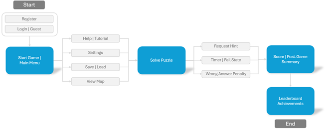

#  Escape Room Software – *S²TN*

A **Software Engineering Project** for *CSCE 247: Software Engineering* at the **University of South Carolina**.  
This project delivers a **Java-based escape room puzzle experience**, with structured gameplay loops, accessibility considerations, and puzzle-solving progression.

---

## 👥 Team Members
- Lance Kimani  
- Nishant Chinnasami  
- Santerria Davis  
- Thaddeus Booraem  
- Solomon Ellis-Summers  

---

## 📖 Project Overview
- 🎯 **Purpose:** Build an interactive escape room game in Java that challenges players through puzzles, guided hints, and progressive feedback.  
- 🖥 **Scope:**  
  - ✅ In-scope: Single-player Java application, save/resume, hints, scoring, accessibility  
  - ❌ Out-of-scope: Multiplayer, web-based delivery, heavy 3D graphics  
- 👤 **Target Users:** Hardcore puzzle solvers, medium-difficulty seekers, and casual escape enthusiasts (personas defined in requirements doc).  

---

## 📊 Diagrams
### 🏗 Class & UML Diagrams
📌 [View UML Diagrams (Lucidchart)](https://lucid.app/lucidchart/14657f64-6750-43e7-ba06-0a7251984d91/edit?existing=1&docId=14657f64-6750-43e7-ba06-0a7251984d91&shared=true&invitationId=inv_c8956674-c14c-44dd-9125-a59121b305e6&page=0_0#)  

📰 [View Class Diagram (PDF)](./docs/diagrams/class/main-UML.pdf)

### 🔄 Process Diagrams
- diagram 1
- diagram 2 

### 💼 Business Use Case Diagram
Illustrates the player journey from access (guest/login/register) through puzzles, hints, scoring, and post-game summary.  

--- 

  

---

## 🧪 Demonstrations
- 🎥 **Video Walkthrough:** 

---

## 📌 Requirements
- 🔧 **Functional Requirements:** [Google Sheet | FR](https://docs.google.com/spreadsheets/d/1Nzz4jI4RE9BPDidwSTXgDZc6qNWl3crWn0uwHmMYTvM/edit?gid=595725144#gid=595725144)  
- ⚙️ **Non-Functional Requirements:** [Google Sheet | NFR](https://docs.google.com/spreadsheets/d/1Nzz4jI4RE9BPDidwSTXgDZc6qNWl3crWn0uwHmMYTvM/edit?gid=918409337#gid=918409337)  
- 📑 **Detailed Specs:** Provided in linked documents above  

---

## 🏆 Competitive Analysis
Benchmarked against:  
- ☕ *The Java Shop’s Perfect Grind* – focused single-session puzzles  
- 🧑‍🤝‍🧑 *Enchambered: Alone Together* – accessibility-first, communication puzzles  
- 🔓 *The Escape Game: Unlocked* – episodic model, save/resume convenience  

---

## 🛠 Tech & Tools
- **Language:** Java  
- **IDE:** VS Code (team preference)  
- **Version Control:** GitHub  
- **Documentation:** UML (Lucidchart), Use Case, Requirements Docs  

---